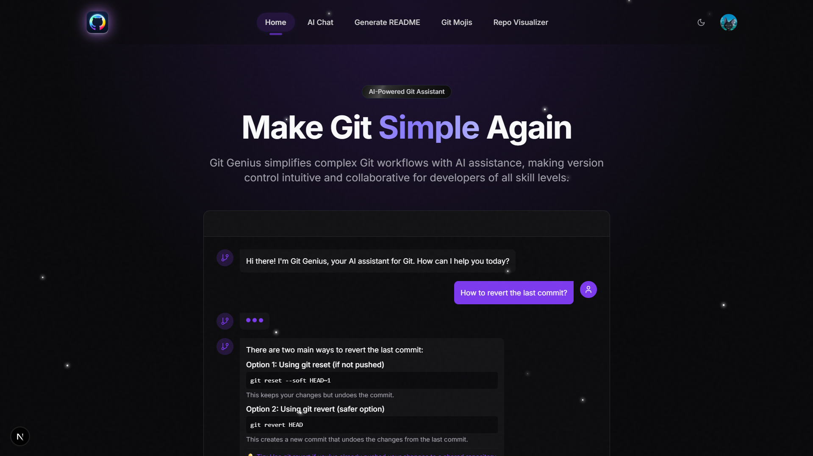

# Git-Genius

<!-- <p align="center">
  
</p>
<p align="center">
  
  
</p> -->

Welcome to **Git-Genius**! 🎉
Your AI-powered GitHub assistant, designed to make managing your repositories easier, smarter, and more efficient than ever before.

<!-- Screenshot Preview -->
<p align="center">
  
</p>

## About 📚

**Git-Genius** is a next-generation tool built with React, TypeScript, and AI to supercharge your GitHub workflow. Whether you're a developer, project manager, or just starting out, Git-Genius helps you navigate GitHub with ease, offering features that save you time and boost productivity.

With Git-Genius, you get:
- **AI Chat for GitHub Help**: Instantly resolve errors or learn Git/GitHub concepts with our AI chat assistant.
- **Dynamic README Generation**: Create custom, professional README files for your repositories in seconds.
- **Commit Emojis (Gitmoji)**: Add expressive emojis to your commits for clarity and fun.

Git-Genius streamlines your GitHub experience so you can focus on what matters most: building great projects.

## Current Features 🚀

- **Google Authentication**: Securely log in with your Google account to unlock all features.
- **AI Chat Integration**: Get real-time help with Git commands, project setup, and more.
- **README Generator**: Generate professional, customizable READMEs for your projects.
- **Gitmoji Support**: Add semantic, expressive emojis to your commit messages.
- **Repository Visualizer**: Explore any public GitHub repository with interactive 3D graphs and detailed stats.
- **User-Friendly Interface**: Modern, intuitive UI for seamless navigation.
- **React Components**: Built with reusable, interactive React components for a responsive experience.

## 🗺️ Roadmap

We're always working to make Git-Genius even better. Upcoming features include:

- [ ] **GitHub OAuth Integration**: Connect directly to your GitHub account for enhanced access.
- [ ] **One-Click README Updates**: Push generated READMEs straight to your repositories.
- [ ] **Enhanced README Customization**: Add badges, images, and custom sections.
- [ ] **Custom Prompt Templates**: Save and reuse your favorite AI prompts.
- [ ] **GitHub Activity Dashboard**: Visualize your GitHub activity and stats.
- [ ] **Badges in README**: Easily add badges like .
- [ ] **Star History**: View your repository's star history over time.

<a href="https://www.star-history.com/#arunava-12/Git-Genius&Timeline">
 <picture>
   <source media="(prefers-color-scheme: dark)" srcset="https://api.star-history.com/svg?repos=arunava-12/Git-Genius&type=Timeline&theme=dark" />
   <source media="(prefers-color-scheme: light)" srcset="https://api.star-history.com/svg?repos=arunava-12/Git-Genius&type=Timeline" />
   
 </picture>
</a>
.

## Tech Stack 💻

- **Languages**: TypeScript, JavaScript, CSS
- **Frameworks/Libraries**: React, Next.js, Octokit, Radix UI, Firebase, TailwindCSS
- **Dev Tools**: Node.js, npm, TypeScript
- **AI Integration**: Groq

## Getting Started 🛠️

### Prerequisites

Before running Git-Genius locally, ensure you have:
- Node.js (v16 or later)
- npm (v8 or later)
- A Google account for authentication
- Required API keys (see environment setup below)

### Installation

1. **Clone the repository:**
```bash
git clone https://github.com/arunava-12/Git-Genius.git
```
2. **Navigate to the project directory:**
```bash
cd Git-Genius
```
3. **Install dependencies:**
```bash
npm install
```
> ⚠️ If you encounter dependency errors, try:
> ```bash
> npm install --legacy-peer-deps
> ```

## 4 🔐 Environment Variables Setup

Create a `.env.local` file in your project root and add the following:

<details>
<summary>🔥 Firebase Configuration</summary>

```env
NEXT_PUBLIC_FIREBASE_API_KEY=your_firebase_api_key
NEXT_PUBLIC_FIREBASE_AUTH_DOMAIN=your_firebase_auth_domain
NEXT_PUBLIC_FIREBASE_PROJECT_ID=your_firebase_project_id
NEXT_PUBLIC_FIREBASE_STORAGE_BUCKET=your_firebase_storage_bucket
NEXT_PUBLIC_FIREBASE_MESSAGING_SENDER_ID=your_firebase_messaging_sender_id
NEXT_PUBLIC_FIREBASE_APP_ID=your_firebase_app_id
FIREBASE_PRIVATE_KEY=your_firebase_private_key
FIREBASE_CLIENT_EMAIL=your_firebase_client_email
```
</details>

<details>
<summary>Other Configuration</summary>

```env
GITHUB_TOKEN=your_github_token_here
GROQ_API_KEY=your_groq_api_key
UPSTASH_REDIS_REST_TOKEN=your_upstash_redis_token
UPSTASH_REDIS_REST_URL=your_upstash_redis_url
```
> **Note:** `GITHUB_TOKEN` is optional but recommended for higher API rate limits. [Get one here.](https://github.com/settings/tokens)
</details>

5. **Start the development server:**
```bash
npm run dev
```

Visit [http://localhost:3000](http://localhost:3000) to use Git-Genius.

## User flow

### Login
1. Go to the homepage and click "Login with Google"
2. Complete the Google authentication
3. You'll be redirected to your dashboard

### Using the README Generator
1. Select "README Generator" from the dashboard
2. Enter your project details
3. Customize sections as needed
4. Click "Generate README"
5. Preview and adjust as needed
6. Download or copy your README

### Using the AI Chat
1. Go to the "AI Chat" section
2. Ask any Git or GitHub question
3. Get instant, AI-powered help

### Using Gitmoji
1. Open the "Gitmoji" section
2. Browse emojis by commit type
3. Click to copy the emoji code
4. Use in your commit messages

### Using the Repository Visualizer
1. Go to "Repository Visualizer"
2. Enter a GitHub repo URL or owner/repo
3. Click "Visualize" to load data
4. Explore via:
   - **Tree View**: File/folder structure
   - **3D Graph**: Interactive visualization
   - **Statistics**: Repo stats and file analysis

## Use Cases 📋

### For Open Source Contributors
Use Git-Genius to quickly generate professional READMEs for your open source projects, making them more accessible to potential contributors.

### For Team Leads
Maintain consistency across your team's repositories by using standardized README templates and commit message practices with Gitmoji.

### For GitHub Beginners
Get assistance with Git commands and best practices through the AI chat feature.

### For Documentation Teams
Streamline the process of creating and updating documentation with AI-powered README generation and formatting.


# Contributing Guidelines

Thank you for your interest in contributing to Git-Genius! To keep things organized and collaborative, please follow these steps:

## 🐛 Reporting Issues & Proposing Features

Before starting any work, **raise an issue** and follow the template below.

### ✅ Issue Template

- **Title**: Concise summary (e.g., `Fix broken login redirect`)
- **Type**: Bug report / Feature request / Improvement
- **Description**:
  - What is the bug, error, or issue?
  - Where did you encounter it?
  - Any relevant logs, screenshots, or recordings?
- **Proposed Solution**:
  - How do you plan to fix or implement it?
  - Any tools, libraries, or dependencies you intend to use?

A maintainer will review your issue.

## 📝 Getting Assigned

🚫 **Do NOT start working on any issue unless it has been assigned to you by a maintainer.**

To get assigned:
1. Raise a clear, descriptive issue using the template above.
2. Comment: `I would like to work on this`.
3. Wait for a maintainer to assign you.

Only after assignment should you begin working on your contribution.

## 🔧 Development Workflow

1. **Fork** this repository.
2. **Clone** your fork locally:
   ```bash
   git clone https://github.com/arunava-12/Git-Genius.git
   cd your-repo-name
   ```
3. **Create a new branch:**
   ```bash
   git checkout -b fix/your-issue-title
   ```
4. **Make your changes** with clear, meaningful commits.
5. **Ensure all tests and linters pass.**
6. **Push your branch and open a Pull Request** referencing the issue number.

---

Thanks for helping improve Git-Genius! 🚀

Feel free to ask questions by commenting on issues or reaching out via [email](mailto:arunavacr7@gmail.com)
